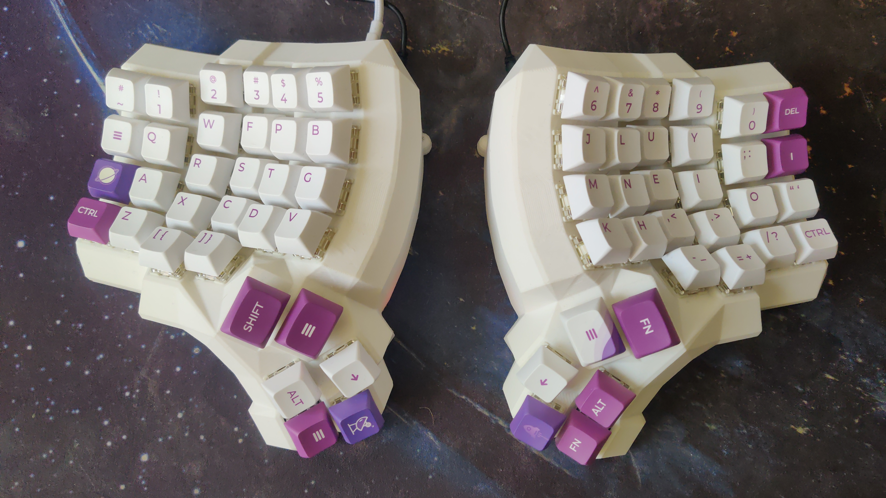

<h1 align="center">
     
        The Dactyl-ManuForm Keyboard
     
</h1>

*This is a fork of a fork of another fork... I can't be bothered to keep track of forks.*

## About this fork
This is for my personal keyboard, which is using the stm32 bluepill boards instead of pro micros.
The 3D model stuff doesn't change much from the other forks, just minor tweaks (although I've added the option to use 1.5u buttons for the pinky column and not used it).

The firmware can be found 
